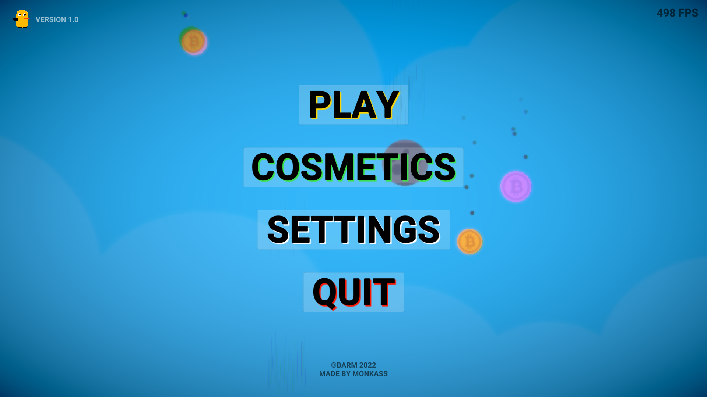
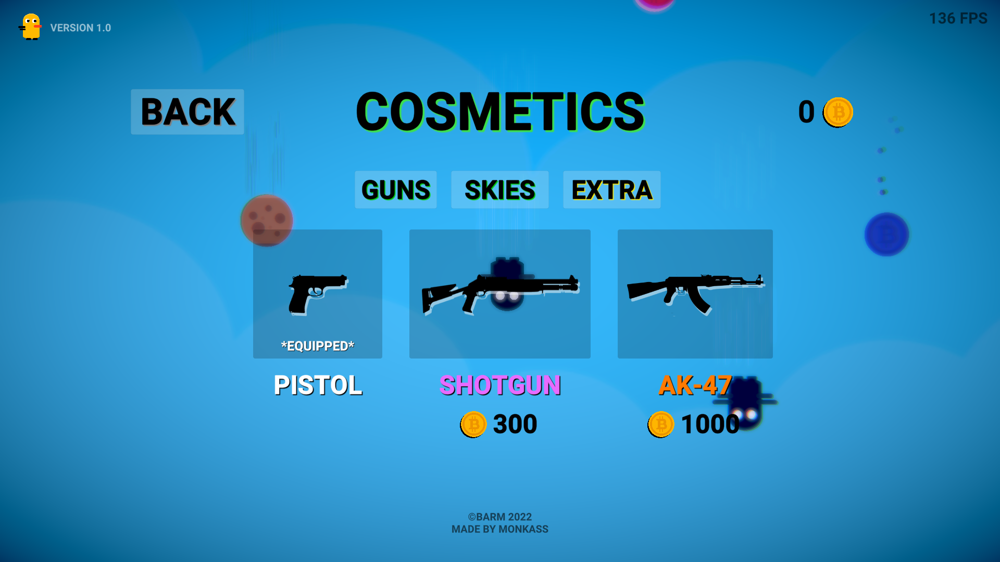
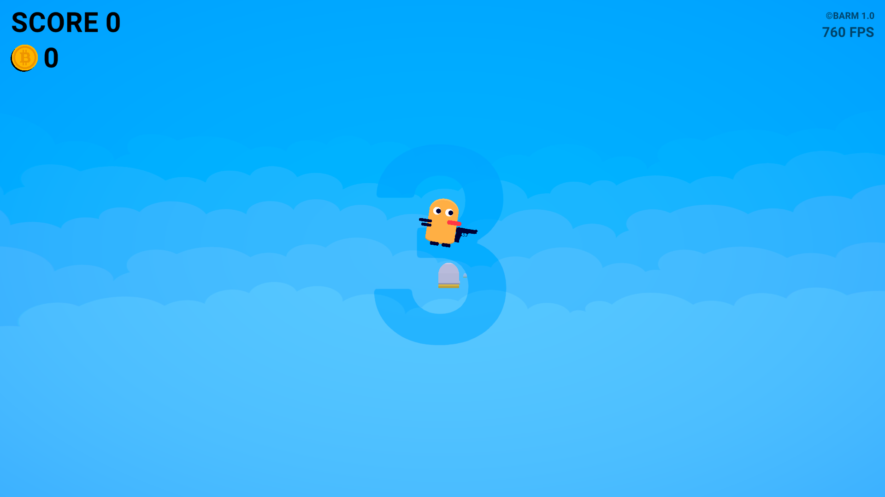

<h1 align="center">Barm</h1>
<h3 align="center">2D Recoil-Driven Physics Arcade Game | Built with Unity & C#</h3>

<p align="center">
  A fast-paced, physics-driven 2D arcade game built in Unity. Featuring an unconventional momentum-based movement engine, projectile tracking, and continuous falling hazards, <strong>Barm</strong> tests structural real-time calculations, input-recoil orchestration, and precision collision validation.
</p>

<p align="center">
  <a href="https://opensource.org/licenses/MIT">
    
  </a>
</p>

---

### ✨ Core Features

* **Recoil-Driven Propulsion Vector:** Leverages Unity's 2D physics engine (`Rigidbody2D` velocity modifiers and impulse mapping) to translate weapon firing into an inverse kinetic thrust. Firing a shot acts as the primary movement engine, sending the player flying backwards to navigate the screen.
* **Dynamic Ammunition State Pipeline:** Implements an atomic tracking architecture initializing the player with a strict 3-bullet capacity constraint. The system handles floating interactive item drops, processing real-time trigger boundaries to capture collectibles and safely increment the ammo counter.
* **Procedural Hazard Downward Cascades:** Orchestrates an automated spawning pattern that drops volatile obstacle components from random horizontal indices above the camera viewport down to the lower boundary screen matrix.
* **Failure State Routine Validation:** Controls precise layer-based collision matrices to separate harmless item pick-ups from high-fatality falling hazards. Intercepting a falling obstacle cleanly halts physics updates and safely routes engine state into a responsive Game Over UI wrapper.

---

### 🛠️ Development Stack

**Game Engine & Logic**
<p align="left">
  
  
</p>

---

### 📸 Gameplay & Systems Showcase

<p align="center">
  
  
</p>
<p align="center">
  
</p>

---

### 🚀 How to Run & Build

**1. Clone the repository:**
```bash
git clone [https://github.com/filipposobrijanu/Barm-Game.git](https://github.com/filipposobrijanu/Barm-Game.git)
cd Barm-Game
